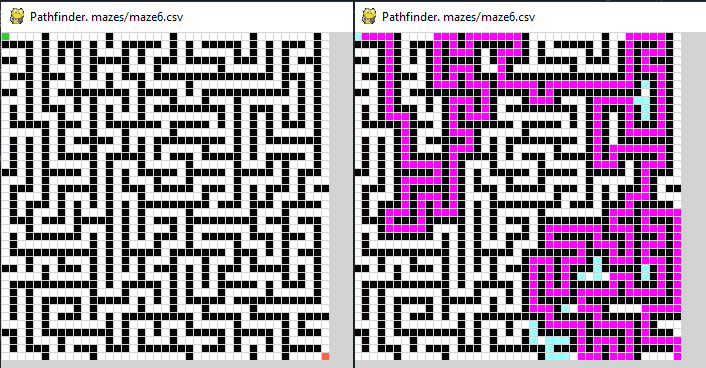

# ai-maze-python

**Automatic Maze generator and Automatic maze solver**

This project consists of two parts: An automatic maze generator and an automatic Maze solver. 

1. The maze generator uses DFS (Depth first search) algorithm to create a maze from a blanck grid. The generated maze can be then saved into a txt or csv file. In order to increase the speed of the generation of mazes its better not to visualize them with Pygame. The folder _Mazes_ contains 20 mazes generated with this method.

2. There are two automatic Maze solvers implemented so that I could better compare the performance of differet algorithms for solving mazes. The first one _dumb-pathfinder_ uses 
DFS to solve the maze blindly. It's inefficient as most of the times runs through the whole maze to find the solution. The interesting pathfinder is _ai-pathfinder_, which uses A* algorithm to find a solution. Using Pygame one can visualize the process of solving the maze. When the solution is found, the script backtracks the path to show the solution found in magenta, as seen in the image below (NOTE: Blue colored cells are explored cells that are not part of the solution). After colving the maze the solution is then saved into a txt or csv file. Folder _mazes-solutions_ contain all the solutions found using A* for the mazes in folder _mazes_.

### Summary of contents in the scripts:
**ai_pathfinder.py**: 
  Solves a given maze using a* algorithm and uses pygame to visualize the solving
  process. At the end prints the grid with the solution found and all the cells explored.

**helper_ai_pathfinder.py**: 
  helper functions used in ai_pathfinder.py
  
**dumb_pathfinder.py**:
  Solves a given maze using Depth-first search (DFS) algorithm and uses Pygame to visualize
  the solving proccess. Not really eficient and many times it explores all the maze before finding the solution.

**helper_pathfinder.py**:
  helper functions used in dumb_pathfinder.py

**maze_generator.py**:
  Generates a maze using Depth-first search (DFS) algorithm and uses Pygame to
  visualize the proccess of generating the maze.

**helper_maze_generator.py**:
  helper functions used in maze_generator.py
  
**mazes folder**:
  contains 20 mazes in csv format generated using maze_generator.py

**mazes_solutions**:
  contains the solutions to the 20 mazes in mazes folder. The solutions are the ones
  given by ai_pathfinder.py, which uses the a* algorithm.
